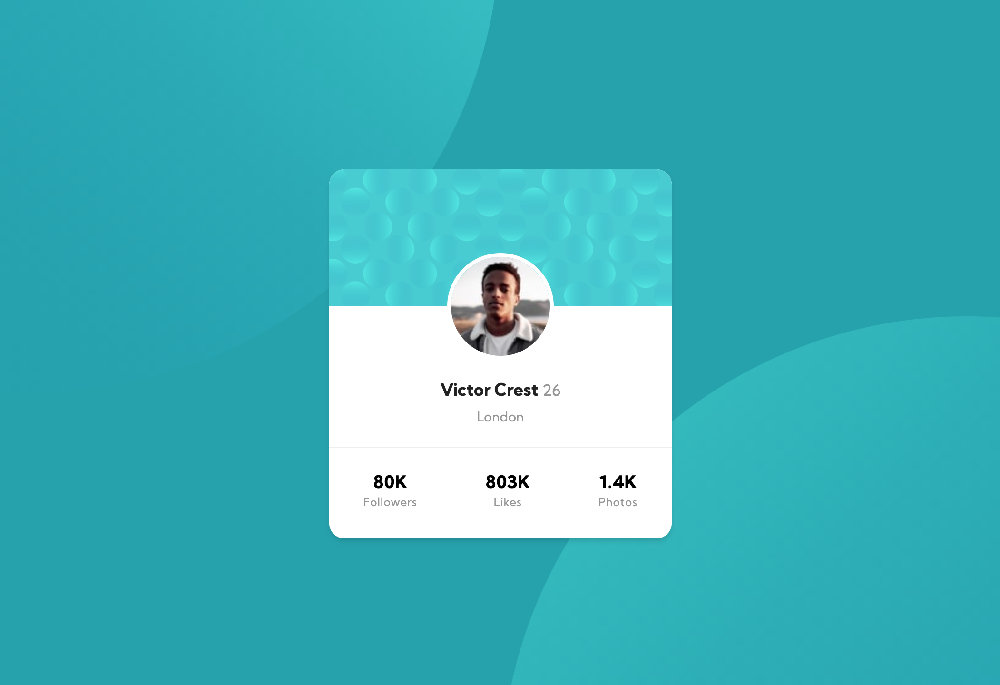

# Frontend Mentor - Profile card component solution

This is a solution to the [Profile card component challenge on Frontend Mentor](https://www.frontendmentor.io/challenges/profile-card-component-cfArpWshJ). Frontend Mentor challenges help you improve your coding skills by building realistic projects. 

## Table of contents

- [Frontend Mentor - Profile card component solution](#frontend-mentor---profile-card-component-solution)
  - [Table of contents](#table-of-contents)
  - [Overview](#overview)
    - [The challenge](#the-challenge)
    - [Screenshot](#screenshot)
    - [Links](#links)
  - [My process](#my-process)
    - [Built with](#built-with)
    - [Useful resources](#useful-resources)
  - [Author](#author)

## Overview

### The challenge

- Build out the project to the designs provided

### Screenshot

### Links

- Solution URL: [Frontend Mentor](https://www.frontendmentor.io/solutions/profile-card-component-with-react-and-styled-components-8aE1RyKBK)
- Live Site URL: [Live Version](https://frontendmentor-profile-card-component-react-styled-components.vercel.app/)

## My process

### Built with

- React (CRA)
- Styled Components
- Typescript

### Useful resources

- [Styled Components](https://styled-components.com/)
- [Create React App](https://github.com/facebook/create-react-app)

## Author

- Frontend Mentor - [@ziin](https://www.frontendmentor.io/profile/ziin)
